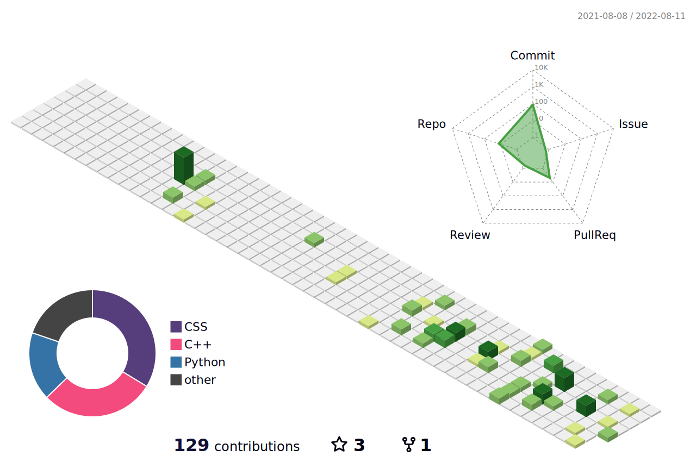

- 👋 Hi, I’m @aslon1213
- 👀 Passionate about backend development, automation, science, AI and exploring new technologies.
- 🌱 I’m currently learning data science
- 💞️ I’m looking to collaborate on any project
- 📫 How to reach me:
  
  
  
  

# Skills:

# Languages

# Frameworks

# Databases

# TOOLS

